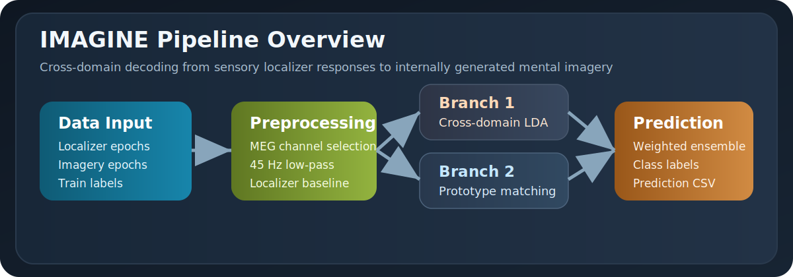
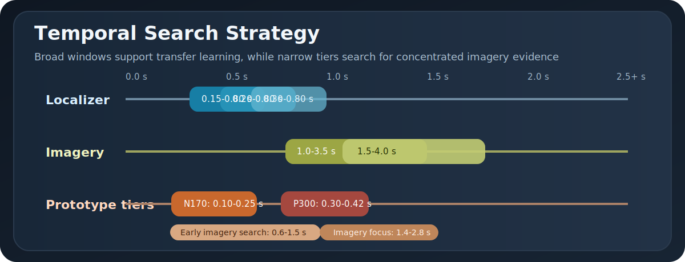
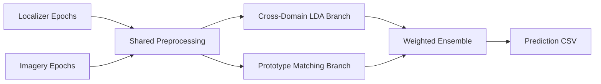
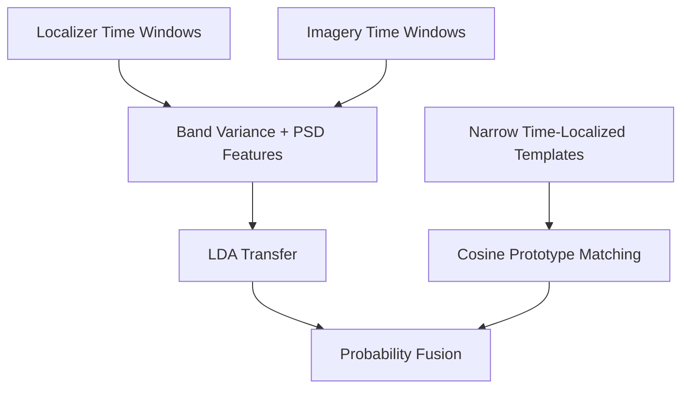

# IMAGINE: Cross-Domain MEG Decoding of Mental Imagery

## Overview

The **IMAGINE** project focuses on decoding human mental imagery from brain activity using Magnetoencephalography (MEG). The primary challenge is to analyze and classify MEG signals generated when subjects imagine one of 10 distinct object categories: `apple`, `bicycle`, `brush`, `cake`, `clown`, `cup`, `desk`, `foot`, `mountain`, and `zebra`.

The core of this problem lies in **cross-domain transfer**: learning spatial and temporal patterns from a localizer phase and applying them to an imagery phase in which subjects internally visualize those same categories. Because mental imagery signals are weak, variable, and temporally diffuse, standard single-domain decoding approaches often fail.

This repository presents the maintained pipeline as a small research codebase under `imagine/`, with clear module boundaries, a CLI, and regression tests.



## Visual Summary







## The Problem

1. **Low Signal-to-Noise Ratio (SNR):** MEG signals related to mental imagery are much weaker than the signals evoked by direct perception.
2. **Temporal Variability:** Different subjects appear to express imagery-relevant information at different moments in time. A single fixed imagery window risks averaging meaningful signal together with noise.
3. **Cross-Domain Shift:** Localizer data and imagery data do not have the same distribution, even when they relate to the same object class.

## The Solution

To achieve robust decoding across subjects, the pipeline combines a cross-domain LDA branch with a time-localized prototype branch.

### 1. Preprocessing & Feature Extraction

- **MEG modalities:** The code uses both gradiometers and magnetometers to capture complementary views of the neural signal.
- **Filtering:** A 45 Hz low-pass filter is applied, and localizer epochs receive baseline correction when a pre-stimulus interval is present.
- **Frequency bands:** Band-variance features are computed from theta (4-8 Hz), alpha (8-13 Hz), and beta (13-30 Hz) activity.

### 2. Multi-Window Temporal Strategy

Because subjects may peak at different times, the pipeline uses multiple temporal windows rather than relying on one fixed imagery segment.

- **LDA branch windows:** Several localizer and imagery windows are scanned to preserve broad temporal coverage.
- **Prototype branch windows:** Narrower time-localized tiers target windows motivated by the earlier exploratory analysis, including N170-like and P300-like localizer ranges plus an earlier imagery search tier.

### 3. Classification via Subject-Specific LDA

The LDA branch is fit independently for each subject and uses several transfer strategies to cope with the localizer-to-imagery shift:

- **Per-domain standardization:** Localizer and imagery features are standardized separately before classification.
- **Shared-norm approaches:** Localizer statistics are reused when transfer appears more stable.
- **PSD strategies:** Welch PSD features are extracted for gradiometer data to provide a complementary spectral representation.

### 4. Prototype Matching

The prototype branch averages localizer trials into class templates at each timepoint, then compares imagery snapshots to those templates with cosine distance.

- **Temporal smoothing:** Both localizer and imagery snapshots are averaged over 30 ms.
- **Sensor complementarity:** Gradiometers emphasize local field gradients, while magnetometers preserve absolute magnetic field information.
- **Per-timepoint scaling:** Localizer and imagery snapshots are standardized independently at each candidate timepoint to reduce domain mismatch.

### 5. Ensemble Voting

The final prediction is formed by combining:

- **60%** cross-domain LDA output
- **40%** narrowed prototype output

If one branch fails, the pipeline falls back to the surviving branch. If both fail, it emits a uniform probability distribution across the ten classes.

## Pipeline Structure

```text
.
|-- imagine/
|   |-- config.py
|   |-- data.py
|   |-- preprocessing.py
|   |-- pipeline.py
|   |-- cli.py
|   `-- branches/
|       |-- c_lda.py
|       `-- peak.py
`-- tests/
    `-- ...
```

## Data Layout

The raw dataset is intentionally kept out of Git. Place the local files beside the repository using this structure:

```text
<data-root>/
|-- train/
|   `-- sub-XX/
|       |-- sub-XX_localizer-epo.fif
|       `-- sub-XX_imagine-epo.fif
|-- test/
|   `-- sub-YY/
|       |-- sub-YY_localizer-epo.fif
|       `-- sub-YY_imagine-epo.fif
|-- labels_imagine-train.csv
`-- sample_submission.csv    # optional
```

If `sample_submission.csv` is present, prediction rows are aligned to it before saving. If it is absent, the output CSV is written directly from the predicted subject trials.

## Installation

Python 3.10 or newer is expected.

```bash
python -m venv .venv
.venv\Scripts\activate
pip install -r requirements.txt
```

Editable install:

```bash
pip install -e .
```

## Usage

Train-set evaluation:

```bash
python -m imagine.cli evaluate-train --data-root C:\path\to\dream
```

Test-set prediction:

```bash
python -m imagine.cli predict-test --data-root C:\path\to\dream --output C:\path\to\dream\predictions.csv
```

Full run:

```bash
python -m imagine.cli run-all --data-root C:\path\to\dream --output C:\path\to\dream\predictions.csv
```

## Neuroscience Background

This repository does not claim to recover a full mechanistic model of imagery. It implements a practical working hypothesis drawn from the original notes and cited literature:

- localizer responses can provide transferable class structure for later imagery decoding
- imagery-relevant evidence may appear in limited temporal pockets rather than across the full trial
- different participants may express those pockets at different latencies
- gradiometers and magnetometers may expose complementary aspects of the same representational dynamics

The N170 and P300 references in the code should be interpreted as heuristic anchors for temporal search, not as proof that those canonical components uniquely explain the decoded information.

## Runtime and Reproducibility Notes

- In the current local environment, one representative training subject took roughly 103 seconds to process end to end.
- Full train-plus-test execution is therefore a deliberate run, not a quick smoke check.
- The CLI sets `numpy` seed `42` for reproducibility.
- The dataset itself is excluded from Git, so exact replication depends on using the same local files.

## Testing

The `tests/` directory includes:

- regression checks against recorded outputs from the original monolithic implementation on one train subject and one test subject
- shape and normalization tests for the branch internals
- path and prediction-writer smoke tests
- CLI help smoke tests

Run the tests with:

```bash
python -m unittest discover -s tests -v
```

## References

- Kern, et al. eLife, 2024. Used in the original script notes as motivation for time-localized imagery decoding.
- Dijkstra, et al. eLife, 2018. Referenced in the original script notes for sensory-to-imagery representational relationships.
- MNE-Python documentation: https://mne.tools/
- SciPy Welch PSD documentation: https://docs.scipy.org/doc/scipy/reference/generated/scipy.signal.welch.html
- scikit-learn LDA documentation: https://scikit-learn.org/stable/modules/generated/sklearn.discriminant_analysis.LinearDiscriminantAnalysis.html

## Notes

This pipeline is exploratory research code. It is not a medical device, not a clinical decision system, and not a validated biomarker pipeline.
